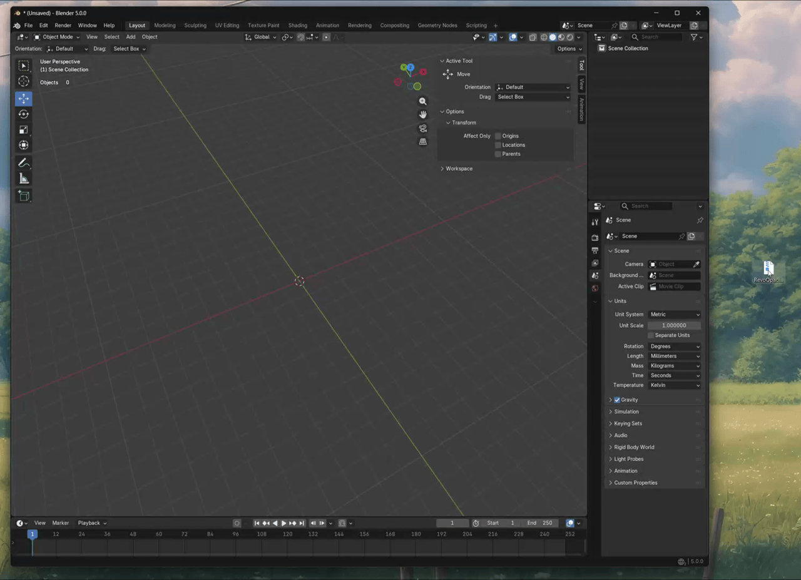
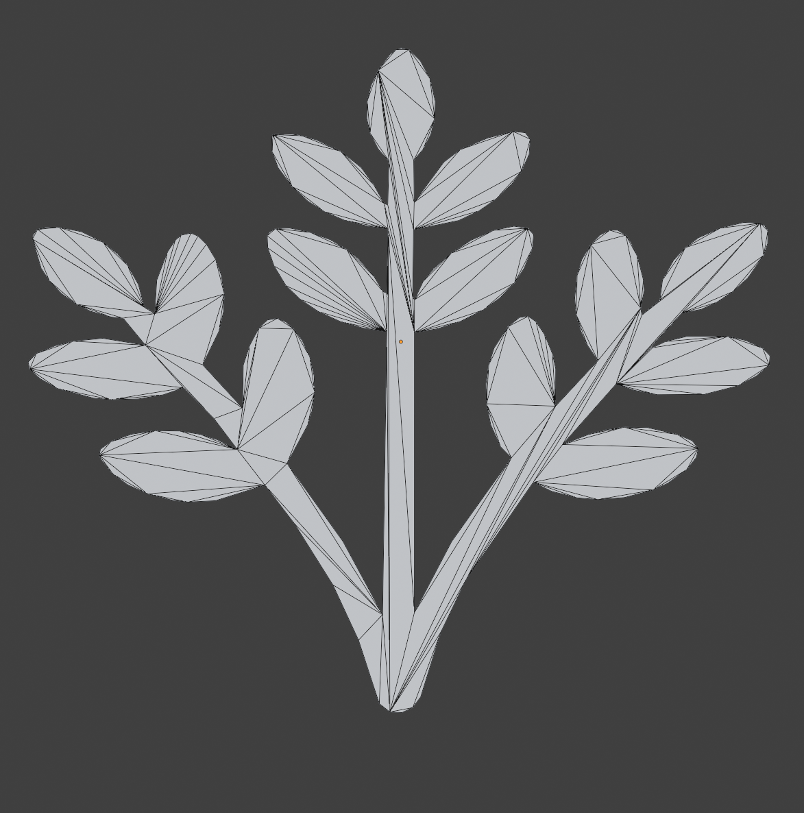

# Installation and Update

Supported Blender versions: 4.2 to 5.1. Recommended: Blender 4.2+.

## Installation

### Drag-and-Drop (Blender 4.2+)

Blender 4.2+ supports direct drag-and-drop installation for extension packages.

1. Open Blender.
2. Drag `RevoOpacityCutout.zip` into the Blender window.
3. Confirm the install prompt.
4. Enable **REVO Opacity Cutout** in **Preferences -> Add-ons**.
5. Restart Blender.

	

### After Installation

Open the **N-Panel** (press `N`) and go to the **REV OpacityCutout** tab. If on first use dependencies are missing, click **Install Dependencies** in the panel to install OpenCV and PyClipper, afterwards restart blender.

## Update

1. Disable the previous version in Blender add-ons.
2. Install the updated plugin package.
3. Re-enable the add-on.
4. Restart Blender if required.

## Verify installation

- Confirm the `REV OpacityCutout` tab appears in the 3D View N-Panel.
- Confirm `Install Dependencies` completes without errors.
- Confirm you can run a first test with `2D / Planar Cutout` on a simple masked plane.

- Open **N-Panel -> REV OpacityCutout**.
- Add or select a simple plane with UVs.
- Assign a material with an opacity mask texture (or pick a mask with the browse button).
- Select a quality preset (quick test low or medium)
- Click `Generate Cutout` in `2D / Planar Cutout`.
- Verify generated geometry follows the opacity silhouette.

You can use the provided sample opacity texture below as a test mask. Right-click the image, save it, and load it in your material or use the browse button to quickly verify the workflow.

	

Expected result if properly installed + the dependencies

	

